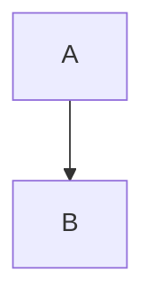

# Plan de Migration : Stockage de Données par Plugin

## 🎯 Objectif

Transformer BigMind en plateforme extensible où les plugins peuvent stocker leurs propres données dans les fichiers `.bigmind`, avec gestion complète du versioning et des migrations automatiques.

## 📋 Vision Globale

### Principes

1. **Isolation** : Chaque plugin a son namespace de données
2. **Graceful Degradation** : Les cartes restent lisibles sans les plugins
3. **Découvrabilité** : Les cartes indiquent quels plugins sont nécessaires
4. **Migration Automatique** : Les données migrent transparently entre versions
5. **Rétrocompatibilité** : Préserver les anciennes données

### Inspiration

- **VS Code** : `.vscode/extensions.json` + workspace settings
- **Obsidian** : Plugins stockent métadonnées dans les fichiers
- **Figma** : Plugins ajoutent données aux documents

---

## 🎁 Concept : Cartes Porteuses d'Extensions

### Philosophie

**Les cartes BigMind deviennent autonomes et auto-descriptives.** Chaque fichier `.bigmind` est un conteneur qui :

1. **Porte ses propres extensions** : La carte déclare explicitement les plugins qu'elle utilise
2. **Étend le schéma de données** : Les plugins ajoutent de nouveaux champs sans modifier le core
3. **Est auto-suffisante** : Toutes les informations pour interpréter la carte sont dans le fichier
4. **Reste interopérable** : Le core BigMind peut toujours lire la structure de base

### Schéma Extensible

```typescript
// ✅ Schéma Core (stable, versionné)
interface BigMindCoreSchema {
  version: '2.0.0';
  nodes: Record<string, MindMapNode>;
  edges: Record<string, MindMapEdge>;
  root: string;
}

// ✅ Extensions par plugins (dynamique, évolutif)
interface BigMindExtendedSchema extends BigMindCoreSchema {
  plugins: PluginMetadata;

  // Chaque plugin peut ajouter ses propres données
  pluginData: {
    'com.bigmind.palette-manager': {
      palettes: { nodes: string; tags: string };
      customColors: Color[];
    };
    'com.bigmind.advanced-layout': {
      algorithm: 'force-directed' | 'hierarchical';
      options: LayoutOptions;
    };
    'com.bigmind.collaboration': {
      comments: Comment[];
      annotations: Annotation[];
      permissions: Permission[];
    };
    // ... infiniment extensible
  };
}
```

### Avantages du Modèle "Carte Porteuse"

#### 1. **Partage Intelligent**

```
Alice crée une carte avec :
  - Plugin "Advanced Layout" (force-directed)
  - Plugin "Custom Palettes" (sunset theme)
  - Plugin "Analytics" (tracking)

Elle partage "projet.bigmind" avec Bob.

Bob ouvre la carte →
  ✓ BigMind détecte automatiquement les plugins nécessaires
  ✓ Propose d'installer "Advanced Layout" et "Custom Palettes"
  ✓ Ignore "Analytics" (marqué comme optionnel)
  ✓ La carte s'affiche correctement avec le bon layout et les bonnes couleurs
```

#### 2. **Évolution Sans Breaking Changes**

```typescript
// Version 1.0 du plugin Layout
pluginData: {
  "com.bigmind.layout": {
    type: "force"  // Simple string
  }
}

// Version 2.0 du plugin (nouveau schéma)
pluginData: {
  "com.bigmind.layout": {
    algorithm: "force-directed",  // Nouveau format
    options: { strength: 0.8 }
  }
}

// ✅ Migration automatique 1->2 préserve les données
// ✅ Le schéma core n'est jamais modifié
// ✅ Pas de breaking change pour les utilisateurs
```

#### 3. **Écosystème de Plugins Richesse**

Les plugins peuvent créer des **extensions de domaine** :

**Exemple : Plugin "Mind Mapping for Education"**

```typescript
pluginData: {
  "com.bigmind.education": {
    learningObjectives: [
      { id: "lo1", description: "Comprendre X", nodeIds: ["n1", "n2"] }
    ],
    assessments: [
      { question: "Quelle est...", answer: "...", linkedTo: "n3" }
    ],
    skillLevel: "beginner" | "intermediate" | "advanced"
  }
}
```

**Exemple : Plugin "Mind Mapping for Project Management"**

```typescript
pluginData: {
  "com.bigmind.project-mgmt": {
    tasks: [
      { id: "t1", nodeId: "n1", assignee: "Alice", dueDate: "2025-02-01", status: "in-progress" }
    ],
    milestones: [
      { name: "MVP", date: "2025-03-01", nodes: ["n1", "n2", "n3"] }
    ],
    dependencies: [
      { from: "t1", to: "t2", type: "finish-to-start" }
    ]
  }
}
```

**Exemple : Plugin "Mind Mapping for Research"**

```typescript
pluginData: {
  "com.bigmind.research": {
    citations: [
      { nodeId: "n1", source: "Smith et al. 2024", url: "...", doi: "..." }
    ],
    hypotheses: [
      { id: "h1", text: "We hypothesize that...", supportingNodes: ["n2", "n3"] }
    ],
    methodology: "qualitative" | "quantitative" | "mixed"
  }
}
```

### Comment les Plugins Étendent le Schéma

#### API d'Extension de Schéma

```typescript
export const manifest: PluginManifest = {
  id: 'com.bigmind.collaboration',
  version: '1.0.0',

  // Déclaration du schéma étendu
  schema: {
    version: '1',
    fields: {
      comments: {
        type: 'array',
        items: {
          id: 'string',
          nodeId: 'string',
          author: 'string',
          text: 'string',
          timestamp: 'number',
        },
      },
      annotations: {
        type: 'array',
        items: {
          id: 'string',
          nodeId: 'string',
          type: 'highlight' | 'note' | 'question',
          content: 'string',
        },
      },
    },
  },
};

// Le plugin peut ensuite utiliser son schéma
export async function activate(context: IPluginContext): Promise<void> {
  // Lire les commentaires
  const comments = (await context.storage.get<Comment[]>('comments')) || [];

  // Ajouter un nouveau commentaire
  comments.push({
    id: generateId(),
    nodeId: 'node-123',
    author: 'Alice',
    text: 'Great point!',
    timestamp: Date.now(),
  });

  // Sauvegarder (schéma validé automatiquement)
  await context.storage.set('comments', comments);

  // Marquer comme requis pour cette carte
  context.markAsRequired();
}
```

#### Validation de Schéma

```typescript
// Optionnel : Validation automatique avec Zod
import { z } from 'zod';

const CommentSchema = z.object({
  id: z.string(),
  nodeId: z.string(),
  author: z.string(),
  text: z.string(),
  timestamp: z.number(),
});

export async function activate(context: IPluginContext): Promise<void> {
  // Validation à la lecture
  const rawComments = await context.storage.get('comments');
  const comments = z.array(CommentSchema).parse(rawComments);

  // TypeScript sait maintenant que comments est bien typé
  comments.forEach(c => console.log(c.author));
}
```

### Portabilité et Interopérabilité

#### Scénario 1 : Carte Partagée Entre Équipes

```
Équipe A (Designer) :
  - Plugin "Color Palettes" ✓
  - Plugin "Icon Library" ✓
  - Plugin "Design System" ✓

Équipe B (Développeur) :
  - Plugin "Code Generator" ✓
  - Plugin "API Documentation" ✓

Carte partagée : "app-architecture.bigmind"
  plugins.required:
    - Color Palettes (pour designers)
    - API Documentation (pour devs)
  plugins.recommended:
    - Code Generator (optionnel)

✅ Chaque équipe voit les informations pertinentes
✅ Les données de chaque plugin coexistent pacifiquement
✅ Pas de conflit, pas de perte d'information
```

#### Scénario 2 : Export/Import Entre Systèmes

```
BigMind Desktop → Export .bigmind
  pluginData conservé intégralement

BigMind Web → Import .bigmind
  ✓ Propose d'installer les plugins manquants
  ✓ Affiche une preview même sans plugins
  ✓ Préserve toutes les données pour réexport

BigMind Mobile → Lecture seule
  ✓ Affiche le core (nodes + edges)
  ✓ Indique "Certaines fonctionnalités requièrent plugins"
  ✓ Données préservées, non modifiées
```

### Self-Contained & Future-Proof

**Une carte BigMind est un document complet qui :**

✅ Contient ses données core (toujours lisibles)
✅ Contient ses extensions (dans pluginData)
✅ Déclare ses dépendances (dans plugins.required)
✅ Documente ses versions (dans \_meta)
✅ Peut migrer automatiquement (avec migrations déclarées)
✅ Reste lisible même dans 10 ans (graceful degradation)

**C'est l'équivalent d'un document Markdown avec front-matter :**

````markdown
---
plugins:
  - name: mermaid
    version: '^10.0.0'
  - name: katex
    version: '^0.16.0'
---

# Mon document


````

$$E = mc^2$$

````

Le document est lisible en plain text, mais **richesse maximale** avec les plugins !

---

## 🏗️ Architecture Cible

### 1. Format de Fichier Étendu

```typescript
interface BigMindFile {
  // Version du format de fichier BigMind
  version: "2.0.0";

  // Métadonnées des plugins
  plugins: {
    required: PluginDependency[];      // Plugins nécessaires
    recommended: PluginDependency[];   // Plugins recommandés
  };

  // Données des plugins (namespace isolé)
  pluginData: {
    [pluginId: string]: PluginStorageData;
  };

  // Données core (inchangées)
  nodes: Record<string, MindMapNode>;
  edges: Record<string, MindMapEdge>;
  root: string;

  // Champs existants à migrer
  nodePaletteId?: string;  // → pluginData['palette-manager'].nodePaletteId
  tagPaletteId?: string;   // → pluginData['palette-manager'].tagPaletteId
}

interface PluginDependency {
  id: string;                    // "com.bigmind.palette-manager"
  minVersion: string;            // "2.0.0"
  maxVersion?: string;           // "3.0.0" (optionnel)
  dataSchemaVersion: string;     // "2" (version du schéma de données)
}

interface PluginStorageData {
  _meta: {
    pluginVersion: string;          // Version du plugin qui a écrit
    schemaVersion: string;          // Version du schéma de données
    writtenAt: string;              // ISO timestamp
    migrationHistory: string[];     // ["1->2", "2->3"]
  };
  data: any;  // Données du plugin
}
````

### 2. API de Stockage pour Plugins

```typescript
interface IPluginStorage {
  /**
   * Lire une donnée avec migration automatique si nécessaire
   */
  get<T>(key: string): Promise<T | undefined>;

  /**
   * Écrire une donnée avec métadonnées automatiques
   */
  set(key: string, value: any): Promise<void>;

  /**
   * Supprimer une donnée
   */
  delete(key: string): Promise<void>;

  /**
   * Obtenir toutes les clés stockées par ce plugin
   */
  keys(): Promise<string[]>;

  /**
   * Enregistrer une fonction de migration
   */
  registerMigration(fromVersion: string, toVersion: string, migrator: MigrationFunction): void;

  /**
   * Version actuelle du schéma de données du plugin
   */
  getSchemaVersion(): string;
  setSchemaVersion(version: string): void;
}

interface IPluginContext {
  // ... existant ...
  storage: IPluginStorage;

  /**
   * Déclarer que ce plugin est nécessaire pour cette carte
   */
  markAsRequired(): void;

  /**
   * Déclarer que ce plugin est recommandé pour cette carte
   */
  markAsRecommended(): void;
}

type MigrationFunction = (oldData: any) => any | Promise<any>;
```

### 3. Déclaration dans le Manifest

```typescript
export const manifest: PluginManifest = {
  id: 'com.bigmind.palette-manager',
  version: '2.1.0',

  // Nouveau : Schéma de données
  dataSchema: {
    version: '2', // Version actuelle
    compatibleWith: ['1', '2'], // Versions lisibles
  },

  // ... reste du manifest ...
};

// Déclaration des migrations
export const migrations: Record<string, MigrationFunction> = {
  '1->2': oldData => {
    // Migrer de v1 à v2
    return {
      palettes: {
        nodes: oldData.nodePaletteId || 'default',
        tags: oldData.tagPaletteId || 'default',
      },
      customPalettes: oldData.customPalettes || [],
    };
  },

  '2->3': async oldData => {
    // Migrer de v2 à v3 (peut être async)
    return {
      ...oldData,
      colorSpace: 'sRGB', // Nouvelle propriété
    };
  },
};
```

---

## 🚀 Plan de Migration

### Phase 1 : Infrastructure de Base (Sprint 1-2)

#### 1.1 Créer le système de stockage

**Fichiers à créer :**

- `apps/web/src/utils/pluginStorage.ts` - Implémentation de IPluginStorage
- `apps/web/src/utils/fileFormat.ts` - Définitions TypeScript du format
- `apps/web/src/utils/pluginDataManager.ts` - Gestion centralisée

**Tâches :**

- [ ] Définir les interfaces TypeScript complètes
- [ ] Implémenter `PluginStorage` avec get/set de base
- [ ] Intégrer dans `IPluginContext`
- [ ] Tests unitaires du stockage

**API simplifiée (sans migration encore) :**

```typescript
class PluginStorage implements IPluginStorage {
  constructor(
    private pluginId: string,
    private fileData: BigMindFile
  ) {}

  async get<T>(key: string): Promise<T | undefined> {
    const pluginData = this.fileData.pluginData?.[this.pluginId];
    return pluginData?.data?.[key];
  }

  async set(key: string, value: any): Promise<void> {
    if (!this.fileData.pluginData) {
      this.fileData.pluginData = {};
    }

    if (!this.fileData.pluginData[this.pluginId]) {
      this.fileData.pluginData[this.pluginId] = {
        _meta: {
          pluginVersion: this.getPluginVersion(),
          schemaVersion: this.getSchemaVersion(),
          writtenAt: new Date().toISOString(),
          migrationHistory: [],
        },
        data: {},
      };
    }

    this.fileData.pluginData[this.pluginId].data[key] = value;

    // Trigger file save
    await this.saveFile();
  }
}
```

#### 1.2 Modifier le format de fichier

**Fichiers à modifier :**

- `packages/shared/src/types/mindmap.ts` - Ajouter champs pluginData
- `apps/web/src/hooks/useOpenFiles.ts` - Gérer nouveau format

**Tâches :**

- [ ] Étendre `MindMapData` avec `pluginData` et `plugins`
- [ ] Assurer backward compatibility (anciens fichiers sans pluginData)
- [ ] Sauvegarder/charger le nouveau format
- [ ] Tests de sérialisation/désérialisation

#### 1.3 Intégration dans le PluginManager

**Fichiers à modifier :**

- `apps/web/src/utils/pluginManager.ts` - Injecter storage dans context
- `packages/plugin-system/src/types/plugin.ts` - Ajouter storage à IPluginContext

**Tâches :**

- [ ] Créer instance de `PluginStorage` pour chaque plugin activé
- [ ] Passer storage dans le context lors de `activate()`
- [ ] Implémenter `markAsRequired()` et `markAsRecommended()`

### Phase 2 : Système de Migration (Sprint 3-4)

#### 2.1 Gestionnaire de migrations

**Fichier à créer :**

- `apps/web/src/utils/migrationManager.ts`

**Implémentation :**

```typescript
class MigrationManager {
  private migrations = new Map<string, Map<string, MigrationFunction>>();

  registerMigration(
    pluginId: string,
    fromVersion: string,
    toVersion: string,
    migrator: MigrationFunction
  ): void {
    if (!this.migrations.has(pluginId)) {
      this.migrations.set(pluginId, new Map());
    }

    const key = `${fromVersion}->${toVersion}`;
    this.migrations.get(pluginId)!.set(key, migrator);
  }

  async migrate(pluginId: string, fromVersion: string, toVersion: string, data: any): Promise<any> {
    // Trouver le chemin de migration
    const path = this.findMigrationPath(pluginId, fromVersion, toVersion);

    if (!path) {
      throw new Error(`No migration path from ${fromVersion} to ${toVersion} for ${pluginId}`);
    }

    // Appliquer chaque migration dans l'ordre
    let currentData = data;
    for (const step of path) {
      const migrator = this.migrations.get(pluginId)?.get(step);
      if (!migrator) {
        throw new Error(`Migration ${step} not found`);
      }
      currentData = await migrator(currentData);
    }

    return currentData;
  }

  private findMigrationPath(pluginId: string, from: string, to: string): string[] | null {
    // Algorithme de recherche de chemin (BFS)
    // ["1->2", "2->3"] pour aller de 1 à 3
    // ...
  }
}
```

**Tâches :**

- [ ] Implémenter `MigrationManager`
- [ ] Algorithme de recherche de chemin de migration
- [ ] Gestion des migrations asynchrones
- [ ] Logging et traçabilité
- [ ] Tests avec différents scénarios

#### 2.2 Intégration dans PluginStorage

**Modifier :**

- `apps/web/src/utils/pluginStorage.ts`

**Améliorer `get()` avec migration automatique :**

```typescript
async get<T>(key: string): Promise<T | undefined> {
  const pluginData = this.fileData.pluginData?.[this.pluginId];
  if (!pluginData) return undefined;

  const storedVersion = pluginData._meta.schemaVersion;
  const currentVersion = this.getSchemaVersion();

  // Migration nécessaire ?
  if (storedVersion !== currentVersion) {
    const migratedData = await this.migrationManager.migrate(
      this.pluginId,
      storedVersion,
      currentVersion,
      pluginData.data
    );

    // Mettre à jour les données avec la version migrée
    pluginData.data = migratedData;
    pluginData._meta.schemaVersion = currentVersion;
    pluginData._meta.migrationHistory.push(`${storedVersion}->${currentVersion}`);

    await this.saveFile();
  }

  return pluginData.data[key];
}
```

**Tâches :**

- [ ] Intégrer MigrationManager dans PluginStorage
- [ ] Migration automatique lors du get()
- [ ] Gestion des erreurs de migration
- [ ] Rollback en cas d'échec
- [ ] Tests de migration end-to-end

#### 2.3 Déclaration des migrations dans les plugins

**Modifier :**

- `packages/plugin-system/src/types/plugin.ts` - Ajouter `migrations` et `dataSchema`

**Exemple avec palette-manager :**

```typescript
// apps/web/src/plugins/palette-manager-plugin.ts

export const manifest: PluginManifest = {
  id: 'com.bigmind.palette-manager',
  version: '2.0.0',
  dataSchema: {
    version: '2',
    compatibleWith: ['1', '2'],
  },
  // ...
};

export const migrations: Record<string, MigrationFunction> = {
  '1->2': oldData => ({
    palettes: {
      nodes: oldData.nodePaletteId || 'default',
      tags: oldData.tagPaletteId || 'default',
    },
  }),
};

export async function activate(context: IPluginContext): Promise<void> {
  // Enregistrer les migrations
  for (const [key, migrator] of Object.entries(migrations)) {
    const [from, to] = key.split('->');
    context.storage.registerMigration(from, to, migrator);
  }

  // Utiliser le storage
  const paletteData = await context.storage.get('palettes');
  // ...
}
```

**Tâches :**

- [ ] Modifier tous les plugins core pour utiliser storage
- [ ] Définir les schémas de données initiaux
- [ ] Tests de chaque plugin avec storage

### Phase 3 : Vérification de Compatibilité (Sprint 5)

#### 3.1 Système de vérification à l'ouverture

**Fichier à créer :**

- `apps/web/src/utils/pluginCompatibility.ts`

**Implémentation :**

```typescript
interface CompatibilityCheck {
  status: 'ok' | 'missing' | 'upgrade-needed' | 'incompatible';
  plugin: PluginDependency;
  installed?: string;
  message: string;
}

function checkFileCompatibility(file: BigMindFile, registry: PluginRegistry): CompatibilityCheck[] {
  const checks: CompatibilityCheck[] = [];

  for (const required of file.plugins?.required || []) {
    const installed = registry.get(required.id);

    if (!installed) {
      checks.push({
        status: 'missing',
        plugin: required,
        message: `Plugin ${required.id} n'est pas installé`,
      });
      continue;
    }

    if (!semver.satisfies(installed.version, `>=${required.minVersion}`)) {
      checks.push({
        status: 'upgrade-needed',
        plugin: required,
        installed: installed.version,
        message: `Mise à jour requise de ${installed.version} vers >=${required.minVersion}`,
      });
      continue;
    }

    if (required.maxVersion && !semver.satisfies(installed.version, `<=${required.maxVersion}`)) {
      checks.push({
        status: 'incompatible',
        plugin: required,
        installed: installed.version,
        message: `Version ${installed.version} trop récente (max: ${required.maxVersion})`,
      });
      continue;
    }

    checks.push({
      status: 'ok',
      plugin: required,
      installed: installed.version,
      message: 'Compatible',
    });
  }

  return checks;
}
```

**Tâches :**

- [ ] Implémenter la vérification de compatibilité
- [ ] Intégrer dans le workflow d'ouverture de fichier
- [ ] Tests avec différents scénarios

#### 3.2 Interface utilisateur de notification

**Fichier à créer :**

- `apps/web/src/components/PluginCompatibilityDialog.tsx`

**Modal à afficher :**

```typescript
interface PluginCompatibilityDialogProps {
  checks: CompatibilityCheck[];
  onContinue: () => void;
  onInstallMissing: (pluginIds: string[]) => void;
  onCancel: () => void;
}

const PluginCompatibilityDialog: React.FC<PluginCompatibilityDialogProps> = ({
  checks,
  onContinue,
  onInstallMissing,
  onCancel
}) => {
  const hasIssues = checks.some(c => c.status !== 'ok');

  if (!hasIssues) return null;

  return (
    <Dialog>
      <DialogTitle>Plugins requis</DialogTitle>
      <DialogContent>
        <p>Cette carte nécessite les plugins suivants :</p>

        {checks.map(check => (
          <PluginCheckItem key={check.plugin.id} check={check} />
        ))}

        {checks.some(c => c.status === 'missing') && (
          <Alert severity="warning">
            Certaines fonctionnalités seront limitées sans ces plugins
          </Alert>
        )}
      </DialogContent>

      <DialogActions>
        <Button onClick={onCancel}>Annuler</Button>
        <Button onClick={onContinue}>Ouvrir quand même</Button>
        {checks.some(c => c.status === 'missing') && (
          <Button
            variant="contained"
            onClick={() => onInstallMissing(
              checks.filter(c => c.status === 'missing').map(c => c.plugin.id)
            )}
          >
            Installer les plugins manquants
          </Button>
        )}
      </DialogActions>
    </Dialog>
  );
};
```

**Tâches :**

- [ ] Créer le composant dialog
- [ ] Intégrer dans le workflow d'ouverture
- [ ] Gérer les actions (installer, continuer, annuler)
- [ ] Tests d'interaction utilisateur

### Phase 4 : Migration des Données Existantes (Sprint 6)

#### 4.1 Migration palette-manager

**Objectif :** Migrer `nodePaletteId` et `tagPaletteId` vers `pluginData`

**Script de migration :**

```typescript
// apps/web/src/migrations/migrateToPluginStorage.ts

async function migratePaletteData(file: BigMindFile): Promise<void> {
  // Si déjà migré, skip
  if (file.pluginData?.['com.bigmind.palette-manager']) {
    return;
  }

  // Créer le pluginData
  if (!file.pluginData) {
    file.pluginData = {};
  }

  // Migrer les données
  file.pluginData['com.bigmind.palette-manager'] = {
    _meta: {
      pluginVersion: '2.0.0',
      schemaVersion: '2',
      writtenAt: new Date().toISOString(),
      migrationHistory: ['legacy->2'],
    },
    data: {
      palettes: {
        nodes: file.nodePaletteId || 'default',
        tags: file.tagPaletteId || 'default',
      },
    },
  };

  // Marquer le plugin comme requis
  if (!file.plugins) {
    file.plugins = { required: [], recommended: [] };
  }

  file.plugins.required.push({
    id: 'com.bigmind.palette-manager',
    minVersion: '2.0.0',
    dataSchemaVersion: '2',
  });

  // Garder les anciens champs pour rétrocompatibilité (phase transitoire)
  // On les supprimera dans une version future
}
```

**Tâches :**

- [ ] Créer le script de migration
- [ ] Exécuter automatiquement à l'ouverture des fichiers
- [ ] Logger les migrations effectuées
- [ ] Tests avec fichiers réels

#### 4.2 Migration automatique au chargement

**Modifier :**

- `apps/web/src/hooks/useOpenFiles.ts`

```typescript
async function openFile(filePath: string): Promise<void> {
  let fileData = await loadFileFromDisk(filePath);

  // Migration automatique si nécessaire
  if (!fileData.pluginData) {
    console.log('🔄 Migration du fichier vers le nouveau format...');
    await migratePaletteData(fileData);
    await saveFileToDisk(filePath, fileData);
    console.log('✅ Migration terminée');
  }

  // Vérifier la compatibilité des plugins
  const checks = checkFileCompatibility(fileData, pluginRegistry);

  if (checks.some(c => c.status !== 'ok')) {
    // Afficher le dialog
    showCompatibilityDialog(checks);
  }

  // Continuer le chargement...
}
```

**Tâches :**

- [ ] Intégrer les migrations dans useOpenFiles
- [ ] Gérer les erreurs de migration
- [ ] Interface de progression si migration longue
- [ ] Tests de migration sur tous les fichiers de test

### Phase 5 : Documentation et Tests (Sprint 7)

#### 5.1 Documentation pour développeurs de plugins

**Créer :**

- `docs/plugin-storage-api.md` - Guide API
- `docs/plugin-data-migration.md` - Guide migrations
- `docs/plugin-storage-examples.md` - Exemples

**Contenu :**

- Comment utiliser `context.storage`
- Comment déclarer des migrations
- Bonnes pratiques de versioning
- Exemples complets
- FAQ

#### 5.2 Tests complets

**Scénarios à tester :**

- [ ] Plugin stocke et lit des données
- [ ] Migration 1->2 fonctionne
- [ ] Migration 1->2->3 (chaîne) fonctionne
- [ ] Fichier sans plugin s'ouvre quand même
- [ ] Plugin manquant : dialog s'affiche
- [ ] Plugin version incompatible : avertissement
- [ ] Données futures (version plus récente) : mode lecture seule
- [ ] Rollback en cas d'erreur de migration
- [ ] Performances avec gros fichiers

---

## 📊 Exemples d'Usage

### Exemple 1 : Plugin Simple

```typescript
// Plugin qui compte les ouvertures de carte

export const manifest: PluginManifest = {
  id: 'com.bigmind.analytics',
  version: '1.0.0',
  dataSchema: {
    version: '1',
    compatibleWith: ['1'],
  },
};

export async function activate(context: IPluginContext): Promise<void> {
  // Lire le compteur
  const stats = (await context.storage.get<{ openCount: number }>('stats')) || {
    openCount: 0,
  };

  // Incrémenter
  stats.openCount++;

  // Sauvegarder
  await context.storage.set('stats', stats);

  console.log(`Cette carte a été ouverte ${stats.openCount} fois`);

  // Marquer comme recommandé
  context.markAsRecommended();
}
```

### Exemple 2 : Plugin avec Migration

```typescript
// Plugin de layout personnalisé

export const manifest: PluginManifest = {
  id: 'com.bigmind.advanced-layout',
  version: '2.0.0',
  dataSchema: {
    version: '2',
    compatibleWith: ['1', '2'],
  },
};

export const migrations = {
  '1->2': (oldData: any) => ({
    algorithm: oldData.layoutType === 'force' ? 'force-directed' : 'hierarchical',
    options: {
      spacing: oldData.spacing || 50,
      direction: oldData.direction || 'horizontal',
      // Nouvelles options en v2
      animation: true,
      duration: 300,
    },
  }),
};

export async function activate(context: IPluginContext): Promise<void> {
  // Enregistrer les migrations
  context.storage.registerMigration('1', '2', migrations['1->2']);
  context.storage.setSchemaVersion('2');

  // Lire les données (migration automatique si v1)
  const layoutConfig = (await context.storage.get('config')) || {
    algorithm: 'hierarchical',
    options: { spacing: 50, direction: 'horizontal', animation: true, duration: 300 },
  };

  // Appliquer le layout
  applyLayout(layoutConfig);

  // Plugin obligatoire pour cette carte
  context.markAsRequired();
}
```

### Exemple 3 : Données Partagées Entre Plugins

```typescript
// Plugin A stocke des métadonnées
export async function activate(context: IPluginContext): Promise<void> {
  await context.storage.set('metadata', {
    author: 'Alice',
    created: Date.now(),
  });

  // Émettre un événement pour les autres plugins
  context.eventBus.emit('metadata:updated', { author: 'Alice' });
}

// Plugin B lit ces métadonnées via événements
export async function activate(context: IPluginContext): Promise<void> {
  context.eventBus.on('metadata:updated', async data => {
    console.log(`Carte créée par ${data.author}`);
  });
}
```

---

## 🎯 Critères de Succès

### Techniques

- [ ] Tous les tests passent
- [ ] TypeScript compile sans erreur
- [ ] Build production réussit
- [ ] Pas de régression sur les fichiers existants
- [ ] Migrations s'exécutent correctement
- [ ] Performances acceptables (< 100ms pour migration)

### Fonctionnels

- [ ] Plugins peuvent stocker/lire des données
- [ ] Migrations automatiques fonctionnent
- [ ] Dialog de compatibilité s'affiche correctement
- [ ] Anciens fichiers s'ouvrent toujours
- [ ] Nouveaux fichiers contiennent pluginData
- [ ] Documentation complète disponible

### UX

- [ ] Pas de friction pour l'utilisateur
- [ ] Messages clairs en cas de problème
- [ ] Suggestions d'installation pertinentes
- [ ] Pas de perte de données

---

## 🚧 Risques et Mitigation

### Risque 1 : Migration échoue

**Mitigation :**

- Backup automatique avant migration
- Rollback en cas d'erreur
- Logs détaillés pour debugging

### Risque 2 : Performances dégradées

**Mitigation :**

- Lazy loading des données plugin
- Cache en mémoire
- Migrations asynchrones en background

### Risque 3 : Conflits de versions

**Mitigation :**

- Versioning strict avec semver
- Tests de compatibilité exhaustifs
- Documentation claire

### Risque 4 : Adoption par les développeurs

**Mitigation :**

- Documentation excellente avec exemples
- Migration assistée des plugins existants
- API simple et intuitive

---

## 📅 Timeline Estimée

| Phase     | Durée         | Livrables                    |
| --------- | ------------- | ---------------------------- |
| Phase 1   | 2 sprints     | API storage de base          |
| Phase 2   | 2 sprints     | Système de migration         |
| Phase 3   | 1 sprint      | Vérification compatibilité   |
| Phase 4   | 1 sprint      | Migration données existantes |
| Phase 5   | 1 sprint      | Documentation et tests       |
| **Total** | **7 sprints** | **Système complet**          |

---

## 🎉 Bénéfices Attendus

1. **Extensibilité Infinie** : N'importe quel plugin peut stocker ce qu'il veut
2. **Découvrabilité** : Les utilisateurs découvrent des plugins via les cartes
3. **Robustesse** : Migration automatique = pas de casse
4. **Isolation** : Namespace empêche les conflits
5. **Partage Intelligent** : Les cartes "savent" leurs dépendances
6. **Écosystème** : Base pour un futur marketplace

---

## 🔗 Fichiers Clés à Créer/Modifier

### Créer

- `apps/web/src/utils/pluginStorage.ts`
- `apps/web/src/utils/migrationManager.ts`
- `apps/web/src/utils/pluginCompatibility.ts`
- `apps/web/src/utils/fileFormat.ts`
- `apps/web/src/components/PluginCompatibilityDialog.tsx`
- `apps/web/src/migrations/migrateToPluginStorage.ts`
- `docs/plugin-storage-api.md`
- `docs/plugin-data-migration.md`

### Modifier

- `packages/shared/src/types/mindmap.ts` - Format fichier
- `packages/plugin-system/src/types/plugin.ts` - IPluginContext
- `apps/web/src/hooks/useOpenFiles.ts` - Chargement/sauvegarde
- `apps/web/src/utils/pluginManager.ts` - Injection storage
- `apps/web/src/plugins/palette-manager-plugin.ts` - Migration exemple

---

## 💬 Questions Ouvertes

1. **Limite de taille** : Faut-il limiter la taille des données par plugin ?
2. **Compression** : Compresser pluginData pour les gros volumes ?
3. **Nettoyage** : Supprimer automatiquement les données des plugins désinstallés ?
4. **Historique** : Garder un historique des versions précédentes (undo/redo) ?
5. **Marketplace** : Intégration avec un futur système de découverte/installation ?

---

## 🚀 Prochaines Étapes

1. **Valider** ce plan avec l'équipe
2. **Prioriser** les phases
3. **Créer** les tickets détaillés pour Phase 1
4. **Démarrer** l'implémentation

---

_Document vivant - Dernière mise à jour : 2025-01-28_
